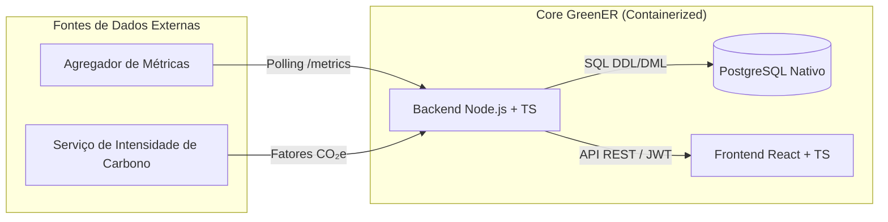
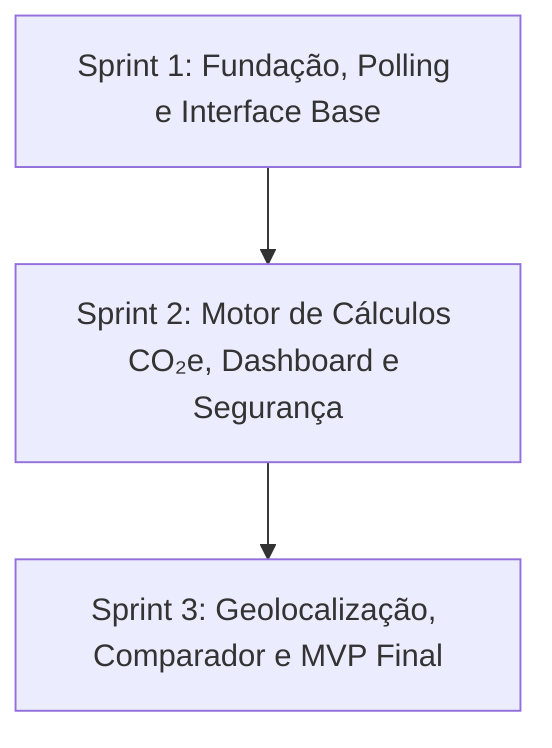

# EcoByteMetrics
> **EcoByteMetrics** — É uma plataforma web voltada à análise e ao monitoramento do consumo energético e da emissão de CO₂e de softwares.

---

## 💡 Visão do Produto & Valor para o Cliente

O **EcoByteMetrics** resolve a falta de visibilidade sobre o impacto ambiental de arquiteturas em nuvem e microsserviços. A plataforma atua em três pilares fundamentais:

* 🔍 **Descoberta & Monitoramento Ativo:** Conecta-se ao ambiente para listar e monitorar dinamicamente microsserviços ativos, detectando indisponibilidades, oscilações ou falhas na exportação de dados em tempo real.
* ⚡ **Análise Ambiental (ESG):** Converte a utilização de recursos (CPU, memória, rede) em consumo energético (kWh) e emissões de carbono (CO₂e) correlacionando dados com a localização geográfica e fatores regionais de carbono.
* 📊 **Gestão Operacional & Comparativa:** Oferece dashboards operacionais, rankings de impacto por período, mapeamento geográfico e comparadores de eficiência ambiental entre aplicações.

---

## 🏗️ Arquitetura do Sistema & Mapeamento de Tecnologias



### ⚙️ Matriz de Diretrizes Técnicas

| Camada / Frente | Tecnologia Utilizada | Regra de Engenharia | Restrição Aplicada |
| :--- | :--- | :--- | :---: |
| **Interface Web** | React + TypeScript | Design responsivo para desktop e mobile | [<span id="rp01">**RP01**</span>](#rp01) |
| **API Backend** | Node.js + TypeScript | Arquitetura modular (Controllers, Services, Modules) | [<span id="rp02">**RP02**</span>](#rp02) |
| **Persistência** | PostgreSQL Nativo | Manipulação estrita via DDL e DML (**Proibido uso de ORM**) | [<span id="rp03">**RP03**</span>](#rp03) |
| **Infraestrutura** | Docker / Docker Compose | Orquestração e execução 100% containerizada | [<span id="rp04">**RP04**</span>](#rp04) |
| **Entregável** | MVP Semestral | Solução funcional focada nas entregas do semestre | [<span id="rp05">**RP05**</span>](#rp05) |
| **Segurança** | Autenticação JWT | Proteção da área de configuração via token no backend | [<span id="rp06">**RP06**</span>](#rp06) |
| **Metodologia** | Scrum / Gestão Ágil | Evolução via Sprints, Backlog priorizado e Reviews | [<span id="rp07">**RP07**</span>](#rp07) |

---

## 📑 Catálogo de Requisitos

<details>
<summary><b>📌 Requisitos Funcionais (RF01 – RF15) — Clique para expandir</b></summary>

| ID | Requisito | Descrição Curta |
| :---: | :--- | :--- |
| <span id="rf01">**RF01**</span> | **Descoberta de Serviços** | Identificar automaticamente os serviços disponíveis no Agregador de Métricas. |
| <span id="rf02">**RF02**</span> | **Monitoramento Dinâmico** | Reconhecer inclusão, remoção e reaparecimento de serviços em tempo de execução. |
| <span id="rf03">**RF03**</span> | **Coleta por Serviço** | Consultar o endpoint `/metrics/{id_servico}` periodicamente. |
| <span id="rf04">**RF04**</span> | **Tratamento de Variações** | Processar variações contínuas nos dados retornados pela API. |
| <span id="rf05">**RF05**</span> | **Detecção de Indisponibilidade** | Sinalizar quando um serviço não responder às chamadas de coleta. |
| <span id="rf06">**RF06**</span> | **Ausência de Métricas** | Identificar serviços presentes em `/services` que não exportem métricas. |
| <span id="rf07">**RF07**</span> | **Cálculo Individual** | Calcular o consumo de energia e emissão de CO₂e de cada aplicação. |
| <span id="rf08">**RF08**</span> | **Indicadores Agregados** | Consolidação dos totais de consumo, emissões e estado dos serviços. |
| <span id="rf09">**RF09**</span> | **Dashboard Operacional** | Exibir estado, localização, métricas, energia e emissões por serviço. |
| <span id="rf10">**RF10**</span> | **Histórico de Coletas** | Armazenar o histórico temporal para auditoria e análises de evolução. |
| <span id="rf11">**RF11**</span> | **Atualização Contínua** | Atualizar a interface automaticamente sem necessidade de reload na página. |
| <span id="rf12">**RF12**</span> | **Localização Geográfica** | Apresentar país, região e cidade onde a aplicação está hospedada. |
| <span id="rf13">**RF13**</span> | **Visualização em Mapa** | Exibir localização dos serviços em um mapa quando coordenadas estiverem disponíveis. |
| <span id="rf14">**RF14**</span> | **Ranking de Impacto** | Ordenar serviços por maior consumo energético ou emissão de CO₂e em determinado período. |
| <span id="rf15">**RF15**</span> | **Comparação de Serviços** | Comparar indicadores ambientais entre múltiplos serviços no mesmo intervalo de tempo. |

</details>

<details>
<summary><b>⚙️ Requisitos Não Funcionais (RNF01 – RNF05) — Clique para expandir</b></summary>

| ID | Requisito | Diretriz de Qualidade |
| :---: | :--- | :--- |
| <span id="rnf01">**RNF01**</span> | **Usabilidade & Responsividade** | Layout responsivo e amigável para navegação em dispositivos móveis e desktop. |
| <span id="rnf02">**RNF02**</span> | **Atualização em Tempo Real** | Intervalos definidos de amostragem com exibição da data/hora da última leitura. |
| <span id="rnf03">**RNF03**</span> | **Desempenho** | Resposta rápida e fluida para o acompanhamento contínuo da infraestrutura. |
| <span id="rnf04">**RNF04**</span> | **Tolerância a Falhas** | Garantir funcionamento contínuo do sistema mesmo com a queda de serviços ou APIs auxiliares. |
| <span id="rnf05">**RNF05**</span> | **Documentação Técnica** | Manual completo com arquitetura, modelo de dados, rotas e instruções de execução. |

</details>

---

## 🎯 Acordos de Qualidade (DoR & DoD)

* **Definition of Ready (DoR):** User Story redigida, critérios de aceitação validados com IDs de RF/RNF, protótipo aprovado no Figma e consultas SQL/endpoints mapeados.
* **Definition of Done (DoD):** Código implementado em TypeScript, consultas SQL em DDL/DML puras salvas no PostgreSQL, aplicação rodando em containers Docker, resiliência validada e aprovação na *Sprint Review*.

---

## 📋 Backlog de Produto (MVP Priorizado)

O backlog foi organizado para priorizar as entregas essenciais do MVP ao longo do semestre.

| ID | User Story | Requisitos Relacionados | Sprint | Check |
| :---: | :--- | :---: | :---: | :---: |
| **US00** | **Setup Infra & Schema SQL:** Docker Compose, tabelas PostgreSQL nativas (DDL/DML) e documentação base. | [RNF05](#rnf05), [RP02](#rp02), [RP03](#rp03), [RP04](#rp04) | 1 | ⏳ |
| **US01** | **UI Responsiva & Localização:** Layout no Figma, exibição da localização dos serviços e atualização automática. | [RF11](#rf11), [RF12](#rf12), [RNF01](#rnf01), [RP01](#rp01) | 1 | ⏳ |
| **US02** | **Polling & Descoberta Dinâmica:** Discovery contínuo e consumo periódico das rotas `/services` e `/metrics`. | [RF01](#rf01), [RF02](#rf02), [RF03](#rf03) | 1 | ⏳ |
| **US03** | **Dashboard & Ranking de Impacto:** Painel operacional com consumo/emissões em tempo real e ordenação por impacto. | [RF09](#rf09), [RF14](#rf14), [RNF02](#rnf02), [RNF03](#rnf03) | 1 / 2 | ⏳ |
| **US04** | **Motor Ambiental & Histórico:** Processamento de consumo elétrico, emissão de CO₂e e persistência temporal no banco. | [RF07](#rf07), [RF08](#rf08), [RF10](#rf10) | 2 | ⏳ |
| **US05** | **Resiliência & Tolerância a Falhas:** Tratamento de oscilações de métricas e erros de APIs externas sem indisponibilidade. | [RF04](#rf04), [RF05](#rf05), [RF06](#rf06), [RNF04](#rnf04) | 2 | ⏳ |
| **US06** | **Autenticação JWT na Configuração:** Acesso protegido por JWT no backend para rotas de configuração administrativa. | [RP06](#rp06) | 2 | ⏳ |
| **US07** | **Visualização Geográfica em Mapa:** Exibição interativa da posição dos serviços em mapa através de coordenadas. | [RF13](#rf13) | 3 | ⏳ |
| **US08** | **Comparador & Consolidação MVP:** Módulo de comparação entre serviços no mesmo período e entrega do MVP containerizado. | [RF15](#rf15), [RP05](#rp05), [RP07](#rp07) | 3 | ⏳ |

---

## ⏳ Cronograma & Entregas das Sprints



##### Tabela Descritiva das Sprints
| Período | Documentação da Sprint | Vídeo |
| :--- | :--- | :--- |
| **Sprint 1:** 01/09 a 25/09/2026 | [Sprint Review](./docs/sprint-1/sprint-1.md) | [▶ YouTube](Link) |
| **Sprint 2:** 28/09 a 23/10/2026 | [Sprint Review](./docs/sprint-2/sprint-2.md) | [▶ YouTube](Link) |
| **Sprint 3:** 26/10 a 20/11/2026 | [Sprint Review](./docs/sprint-3/sprint-3.md) | [▶ YouTube](Link) |

---

#### 📑 Gestão Scrum
* [**Sprint Planning**](https://github.com)
* [**Daily Meetings**](https://github.com)
* [**Sprint Retrospectives**](https://github.com)

---

## 📂 Organização do Repositório

```bash
├── backend/                  # API REST Node.js + TypeScript
│   ├── src/
│   │   ├── controllers/      # Handlers das requisições HTTP
│   │   ├── services/         # Polling, regras de negócio e cálculo ambiental
│   │   ├── database/         # Conexão nativa PostgreSQL e scripts SQL
│   │   └── middlewares/      # Interceptador e validação de token JWT
│   ├── Dockerfile            # Configuração Docker do Backend
│   └── package.json
├── frontend/                 # Aplicação Web React + TypeScript
│   ├── src/
│   │   ├── components/       # Cards, Tabelas, Gráficos e Mapa
│   │   ├── pages/            # Views e telas do sistema
│   │   └── services/         # Cliente de comunicação HTTP com a API
│   ├── Dockerfile            # Configuração Docker do Frontend
│   └── package.json
├── database/                 # Persistência nativa sem ORM
│   ├── ddl.sql               # Script de estrutura de tabelas
│   └── dml.sql               # Script de carga inicial
├── docker-compose.yml        # Orquestrador do ambiente em containers
├── .env.example              # Arquivo modelo de variáveis de ambiente
└── README.md                 # Documentação principal
```

---

## 🚀 Guia de Execução (Via Docker)

Toda a aplicação é obrigatoriamente executada através de containers Docker.

### Pré-requisitos
* **Docker Engine** e **Docker Compose** instalados na máquina.

### Execução em 4 Passos

1. **Clonar o Repositório e Configurar `.env`:**
```bash
git clone <URL_DO_REPOSITORIO>
cd greener
cp .env.example .env
```

2. **Subir Aplicação Containerizada:**
```bash
docker compose up --build -d
```

3. **Carga Inicial do Banco de Dados (DDL/DML):**
```bash
docker exec -i greener_postgres psql -U greener_user -d greener_db < database/ddl.sql
docker exec -i greener_postgres psql -U greener_user -d greener_db < database/dml.sql
```

4. **Portas de Acesso Local:**
* **Frontend Dashboard:** `http://localhost:5173`
* **Backend API REST:** `http://localhost:3000`

---

## 👥 Equipe

<body>
   <div align="center">
      <table>
         <thead>
            <th>Scrum Master</th>
            <th>Product Owner</th>
            <th>Dev Team</th>
            <th>Dev Team</th>
            <th>Dev Team</th>
         </thead>
         <tbody>
            <tr>
               <th><a href="link github"></a></th>
               <th><a href="link github"></a></th>
               <th><a href="link github"></a></th>
               <th><a href="link github"></a></th>
               <th><a href="link github"></a></th>
            </tr>
            <tr>
               <th><a href="Link do Linkedin"></a></th>
               <th><a href="Link do Linkedin"></a></th>
               <th><a href="Link do Linkedin"></a></th>
               <th><a href="Link do Linkedin"></a></th>
               <th><a href="Link do Linkedin"></a></th>
            </tr>
         </tbody>
      </table>
   </div>
</body>

## 📝 Convenções de Versionamento (Git)

### Padrão de Commits
As mensagens devem conter o ID da Issue vinculada:
* `tipo (#id_issue): descrição clara do trabalho`
* *Exemplo:* `feat (#12): implementar calculo de emissao de CO2e`

### Padrão de Branches
* `tipo/id_issue-nome-curto` 
* *Exemplo:* `feat/12-calculo-co2e`

**Tipos autorizados:** `feat`, `fix`, `docs`, `style`, `refactor`, `test`, `chore`, `cleanup`, `remove`.

---

## 🔗 Documentos de Apoio
* [Pasta de Documentação Técnica](./docs) 
* [Documentação dos Endpoints da API](./docs/docApi.md)
