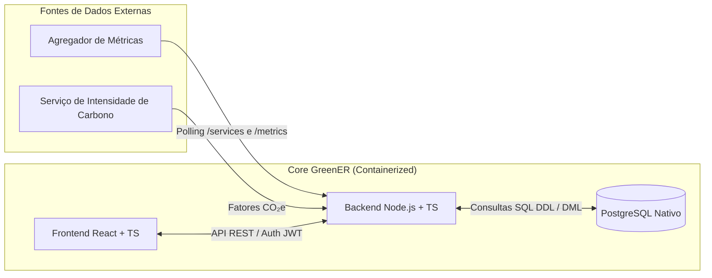
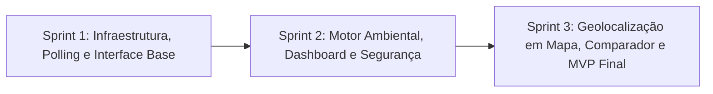

# 🍃 EcoByteMetrics (GreenER)

O **EcoByteMetrics** é uma plataforma web voltada para a análise e o monitoramento do consumo energético e das emissões de CO₂e em softwares.

---

### 💡 Sobre o Projeto
A plataforma resolve a falta de visibilidade sobre o impacto ambiental de arquiteturas em nuvem e microsserviços. O sistema conecta-se ao ambiente para listar e monitorar dinamicamente os microsserviços ativos, identificando indisponividades e falhas na exportação de métricas. 

A utilização de recursos de hardware, como CPU, memória e rede, é convertida em consumo elétrico (kWh) e emissões de carbono (CO₂e) com base na localização geográfica e em fatores regionais de emissão. A aplicação disponibiliza painéis operacionais, rankings de impacto, mapeamento geográfico e comparadores de eficiência entre serviços.

---

### 🏗️ Arquitetura e Tecnologias
A solução foi estruturada para ser executada em ambiente containerizado, garantindo isolamento e reprodutibilidade.


```mermaid
graph LR
    subgraph "Fontes de Dados Externas"
        AM[Agregador de Métricas]
        SC[Serviço de Intensidade de Carbono]
    end

    subgraph "Core GreenER (Containerized)"
        FE[Frontend React + TS]
        BE[Backend Node.js + TS]
        DB[(PostgreSQL Nativo)]
    end

    AM -->|Polling /services e /metrics| BE
    SC -->|Fatores CO₂e| BE
    FE <-->|API REST / Auth JWT| BE
    BE <-->|Consultas SQL DDL / DML| DB
```

<details>
<summary><b>🛠️ Diretrizes e Restrições Técnicas</b></summary>

<br>

| Camada / Frente | Tecnologia Utilizada | Regra de Engenharia | Restrição Aplicada |
| :--- | :--- | :--- | :--- |
| **Interface Web** | React + TypeScript | Design responsivo para desktop e mobile | **RP01** |
| **API Backend** | Node.js + TypeScript | Arquitetura modular (Controllers, Services, Modules) | **RP02** |
| **Persistência** | PostgreSQL Nativo | Manipulação estrita via DDL e DML (**Proibido uso de ORM**) | **RP03** |
| **Infraestrutura** | Docker / Docker Compose | Orquestração e execução 100% containerizada | **RP04** |
| **Entregável** | MVP Semestral | Solução funcional focada nas entregas do semestre | **RP05** |
| **Segurança** | Autenticação JWT | Proteção da área de configuração via token no backend | **RP06** |
| **Metodologia** | Scrum / Gestão Ágil | Evolução via Sprints, Backlog priorizado e Reviews | **RP07** |

</details>

A camada de interface web foi desenvolvida com React e TypeScript para promover responsividade em dispositivos móveis e desktop. O backend foi construído em Node.js com TypeScript, seguindo uma estrutura modular dividida em controllers, services e repositories. A persistência de dados utiliza o banco PostgreSQL de forma nativa por meio de comandos SQL explícitos em DDL e DML, sem a utilização de ORMs. A comunicação e o acesso às rotas administrativas são protegidos via tokens de autenticação JWT.

---

### 🔌 Integração com APIs Externas
O sistema consome duas APIs externas para realizar a coleta de métricas e o cálculo do impacto ambiental.

1. **Agregador de Métricas:** A rota `GET /services` realiza a descoberta das aplicações e o endpoint `GET /metrics/{id_servico}` obtém as amostras de consumo de hardware (`METRICS_AGGREGATOR_URL=http://agregador-metricas.local:8080`).
2. **Serviço de Intensidade de Carbono:** A rota `GET /carbon-intensity/{code}` obtém os fatores regionais de emissão para o cálculo de carbono (`CARBON_INTENSITY_URL=http://carbon-intensity.local:8081`).

---

### 🗄️ Estrutura do Banco de Dados
A modelagem do banco relacional utiliza SQL nativo e explícito no PostgreSQL.

<details>
<summary><b>🗃️ Clique para expandir o Script SQL DDL (DDL.sql)</b></summary>

<br>

```sql
create table Users(
	id_user int GENERATED ALWAYS AS IDENTITY PRIMARY KEY,
	name_user varchar(50) not null,
	email_user varchar(50) not null,
	password_user varchar(25) not null,
	token_user varchar(255) not null
);

create table Locations(
	id_location int GENERATED ALWAYS AS IDENTITY PRIMARY KEY,
	name_location varchar(50) not null,
	county_location varchar(50),
	region_location varchar(50),
	city_location varchar(50),
	latitude_location double precision not null,
	logitude_location double precision not null
);

create table Services(
	id_service int GENERATED ALWAYS AS IDENTITY PRIMARY KEY,
	id_location int,
	name_service varchar(50),
	constraint fk_service 
		foreign key (id_location)
		references locations(id_location)
);

create table Metrics (
	id_metric int GENERATED ALWAYS AS IDENTITY PRIMARY KEY,
	id_service int,
	date_houry TIMESTAMP NOT NULL,
	path_metric varchar(50) not null,
	colletion_interval_metric int not null,
	cpu_metric numeric not null,
	ram_metric numeric not null,
	hd_metric numeric not null,
	network_metric numeric not null,
	constraint fk_service
		foreign key (id_service)
		references services(id_service)
);

create table Cabons(
	id_carbon int GENERATED ALWAYS AS IDENTITY PRIMARY KEY,
	id_location int,
	date_houry TIMESTAMP not null,
	intesity_co2e_kwh_carbon int not null,
	renewable_percent_carbon int not null,
	constraint fk_service
		foreign key (id_location)
		references locations(id_location)
);
```

</details>

---

### 📑 Requisitos do Sistema
O escopo do projeto está catalogado em requisitos funcionais e não funcionais que orientam o desenvolvimento do software.

<details>
<summary><b>📋 Requisitos Funcionais (RF01 a RF15)</b></summary>

<br>

| ID | Requisito | Descrição Curta |
| :--- | :--- | :--- |
| **RF01** | **Descoberta de Serviços** | Identificar automaticamente os serviços disponíveis no Agregador de Métricas. |
| **RF02** | **Monitoramento Dinâmico** | Reconhecer inclusão, remoção e reaparecimento de serviços em tempo de execução. |
| **RF03** | **Coleta por Serviço** | Consultar o endpoint `/metrics/{id_servico}` periodicamente. |
| **RF04** | **Tratamento de Variações** | Processar variações contínuas nos dados retornados pela API. |
| **RF05** | **Detecção de Indisponibilidade** | Sinalizar quando um serviço não responder às chamadas de coleta. |
| **RF06** | **Ausência de Métricas** | Identificar serviços presentes em `/services` que não exportem métricas. |
| **RF07** | **Cálculo Individual** | Calcular o consumo de energia e emissão de CO₂e de cada aplicação. |
| **RF08** | **Indicadores Agregados** | Consolidação dos totais de consumo, emissões e estado dos serviços. |
| **RF09** | **Dashboard Operacional** | Exibir estado, localização, métricas, energia e emissões por serviço. |
| **RF10** | **Histórico de Coletas** | Armazenar o histórico temporal para auditoria e análises de evolução. |
| **RF11** | **Atualização Contínua** | Atualizar a interface automaticamente sem necessidade de reload na página. |
| **RF12** | **Localização Geográfica** | Apresentar país, região e cidade onde a aplicação está hospedada. |
| **RF13** | **Visualização em Mapa** | Exibir localização dos serviços em um mapa quando coordenadas estiverem disponíveis. |
| **RF14** | **Ranking de Impacto** | Ordenar serviços por maior consumo energético ou emissão de CO₂e em determinado período. |
| **RF15** | **Comparação de Serviços** | Comparar indicadores ambientais entre múltiplos serviços no mesmo intervalo de tempo. |

</details>

<details>
<summary><b>⚡ Requisitos Não Funcionais (RNF01 a RNF05)</b></summary>

<br>

| ID | Requisito | Diretriz de Qualidade |
| :--- | :--- | :--- |
| **RNF01** | **Usabilidade & Responsividade** | Layout responsivo e amigável para navegação em dispositivos móveis e desktop. |
| **RNF02** | **Atualização em Tempo Real** | Intervalos definidos de amostragem com exibição da data/hora da última leitura. |
| **RNF03** | **Desempenho** | Resposta rápida e fluida para o acompanhamento contínuo da infraestrutura. |
| **RNF04** | **Tolerância a Falhas** | Garantir funcionamento contínuo do sistema mesmo com a queda de serviços. |
| **RNF05** | **Documentação Técnica** | Manual completo com arquitetura, modelo de dados, rotas e instruções de execução. |

</details>

---

### 📋 Planejamento e Sprints
O desenvolvimento do MVP foi planejado em três entregas incrementais ao longo do semestre.

| ID | User Story | Requisitos Relacionados | Sprint |
| :--- | :--- | :--- | :--- |
| **US00** | **Setup Infra & Schema SQL:** Docker Compose, tabelas PostgreSQL nativas (DDL) e documentação base. | RNF05, RP02, RP03, RP04 | **Sprint 1** |
| **US01** | **UI Responsiva & Localização:** Layout no Figma, exibição da localização dos serviços e atualização automática. | RF11, RF12, RNF01, RP01 | **Sprint 1** |
| **US02** | **Polling & Descoberta Dinâmica:** Discovery contínuo e consumo periódico das rotas `/services` e `/metrics`. | RF01, RF02, RF03 | **Sprint 1** |
| **US03** | **Dashboard & Ranking de Impacto:** Painel operacional com consumo/emissões em tempo real e ordenação por impacto. | RF09, RF14, RNF02, RNF03 | **Sprint 2** |
| **US04** | **Motor Ambiental & Histórico:** Processamento de consumo elétrico, emissão de CO₂e e persistência temporal. | RF07, RF08, RF10 | **Sprint 2** |
| **US05** | **Resiliência & Tolerância a Falhas:** Tratamento de oscilações de métricas e erros de APIs externas. | RF04, RF05, RF06, RNF04 | **Sprint 2** |
| **US06** | **Autenticação JWT na Configuração:** Acesso protegido por JWT no backend para rotas de configuração. | RP06 | **Sprint 2** |
| **US07** | **Visualização Geográfica em Mapa:** Exibição interativa da posição dos serviços em mapa. | RF13 | **Sprint 3** |
| **US08** | **Comparador & Consolidação MVP:** Módulo de comparação entre serviços e entrega do MVP containerizado. | RF15, RP05, RP07 | **Sprint 3** |

As histórias de usuário seguem critérios objetivos de alinhamento e prontidão (DoR) e de conclusão e validação (DoD).

---

## Planeamento das Sprints


```mermaid
graph LR
	S1[Sprint 1: Infraestrutura, Polling e Interface Base] --> S2[Sprint 2: Motor Ambiental, Dashboard e Segurança]
	S2 --> S3[Sprint 3: Geolocalização em Mapa, Comparador e MVP Final]
```

---

### Tabela de desenvolvimento e datas de previstas de cada etapa

|             Período              |            Documentação da Sprint            |                   Vídeo                   |
| :------------------------------: | :------------------------------------------: | :---------------------------------------: |
| **Sprint 1:** 28/09 a 19/10/2026 | [Sprint Review](./docs/sprints/sprint-1/sprint-1.md) | [▶ YouTube](https://youtu.be/7RxJdSmYO0c) |
| **Sprint 2:** 20/10 a 09/11/2026 | [Sprint Review](./docs/sprints/sprint-2/sprint-2.md) | [▶ YouTube](https://youtu.be/) |
| **Sprint 3:** 10/11 a 23/11/2026 | [Sprint Review](./docs/sprints/sprint-3/sprint-3.md) | [▶ YouTube](https://youtu.be/) |

---

### 🚀 Como Executar o Projeto
Toda a infraestrutura do sistema é orquestrada através de containers Docker para garantir facilidade de execução.

#### Pré-requisitos
É necessário ter o Docker Engine e o Docker Compose instalados no ambiente local.

#### Passo a Passo
1. **Configurar as Variáveis de Ambiente:**
   Crie o arquivo de ambiente `.env` copiando o modelo de exemplo:
   ```bash
   cp .env.example .env
   ```

2. **Iniciar os Containers:**
   Suba os serviços do frontend, backend e banco de dados via Docker Compose:
   ```bash
   docker compose up --build -d
   ```

3. **Inicializar o Banco de Dados:**
   Execute o script DDL nativo para criar a estrutura das tabelas no container do PostgreSQL:
   ```bash
   docker exec -i greener_postgres psql -U greener_user -d greener_db < database/DDL.sql
   ```

4. **Acessos Locais:**
   Após a inicialização, o painel web fica disponível em `http://localhost:5173` e a API REST em `http://localhost:3000`.

---

### 📂 Estrutura do Repositório
O repositório está organizado de forma modular, contendo documentações específicas para cada módulo e para o planejamento geral do projeto.

```bash
greener/
├── README.md                   # Manual principal e guia de execução
├── .env.example                # Modelo de variáveis de ambiente
├── compose.yaml                # Arquivo de orquestração do Docker Compose
├── frontend/                   # Aplicação Web em React + TypeScript
│   ├── README.md               # Guia de execução e telas do frontend
│   ├── Dockerfile
│   └── src/
├── backend/                    # API REST em Node.js + TypeScript
│   ├── README.md               # Guia de módulos e integrações do backend
│   ├── Dockerfile
│   └── src/
├── database/                   # Persistência relacional sem ORM
│   ├── README.md               # Instruções de restauração do PostgreSQL
│   └── DDL.sql              # Script DDL oficial com a estrutura de tabelas
└── docs/                       # Documentação técnica e planejamento
    ├── plano-de-entregas.md    # Matriz oficial da Rubrica e rastreabilidade da equipe
    ├── arquitetura.md          # Fluxo de dados e diagramas da solução
    ├── calculos.md             # Memória de cálculo de consumo energético e CO₂e
    ├── api.md                  # Especificação das rotas REST e autenticação JWT
    └── sprints/
        ├── sprint-1.md         # Registro da Sprint Review 1 e evidências
        ├── sprint-2.md
        └── sprint-3.md
```

---

### 👥 Equipe do Projeto
<body>
<div align="center">
<table>
<thead>
<th>Scrum Master</th>
<th>Product Owner</th>
<th>Dev Team</th>
<th>Dev Team</th>
<th>Dev Team</th>
</thead>
<tbody>
<tr>
<th><a href="https://github.com/ViniciusGuin"></a></th>
<th><a href="https://github.com/Cauaisq"></a></th>
<th><a href="https://github.com/VtecturboBr"></a></th>
<th><a href="https://github.com/ThiagoDT"></a></th>
<th><a href="https://github.com/EnzoSuzukiProkopas"></a></th>
</tr>
<tr>
<th><a href="Link do Linkedin"></a></th>
<th><a href="Link do Linkedin"></a></th>
<th><a href="Link do Linkedin"></a></th>
<th><a href="Link do Linkedin"></a></th>
<th><a href="Link do Linkedin"></a></th>
</tr>
</tbody>
</table>
</div>
</body>

---

### 📝 Padronização de Versionamento (Git)
Os commits e branches devem manter a rastreabilidade com as tarefas do repositório.
* **Commits:** Devem conter o tipo da alteração e o número da issue correspondente (exemplo: `feat (#21): implementar integracao com agregador de metricas`).
* **Branches:** Devem indicar a categoria e a tarefa associada (exemplo: `feat/21-integracao-services`).

---

### 📚 Documentação Complementar
Para detalhamento técnico completo e acompanhamento do projeto, consulte os arquivos presentes na pasta `docs/`:

* 📅 **[Plano de Entregas & Rubrica](./docs/plano-de-entregas.md):** Matriz de rastreabilidade, responsáveis e status dos critérios.
* 🔌 **[Especificação da API REST](./docs/api.md):** Detalhamento dos endpoints, parâmetros, respostas JSON e segurança JWT.
* 📐 **[Arquitetura do Sistema](./docs/arquitetura.md):** Responsabilidades dos módulos e fluxo de dados.
* 🧮 **[Memória de Cálculo Ambiental](./docs/calculos.md):** Fórmulas e fatores de conversão em kWh e CO₂e.
* 📄 **[Relatório da Sprint Review 1](./docs/sprints/sprint-1.md):** Resumo das entregas, autoavaliação e evidências da Sprint 1.
