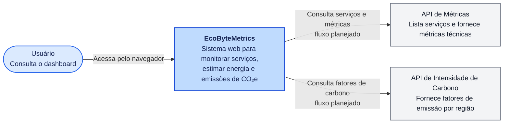
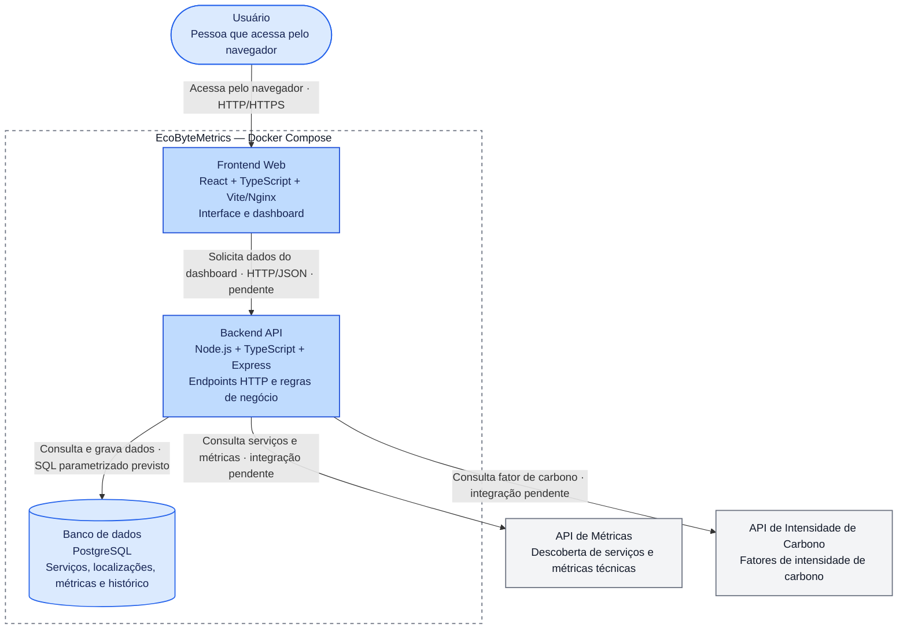
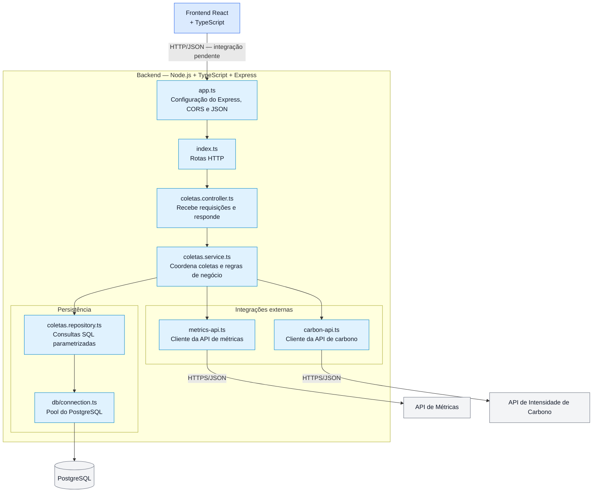
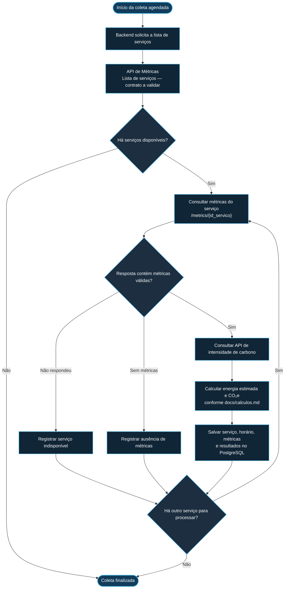
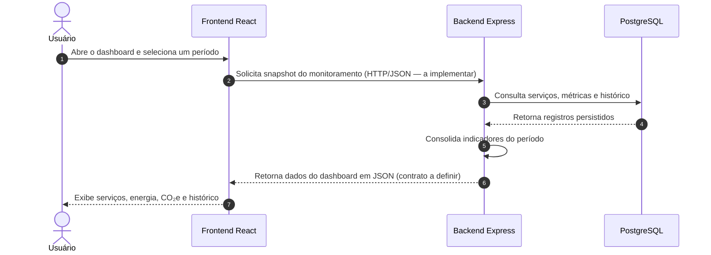

# Arquitetura, diagramas C4 e fluxos de dados — EcoByteMetrics

> **Objetivo:** documentar a arquitetura proposta do EcoByteMetrics com diagramas Mermaid, incluindo contexto C4, containers C4, arquitetura lógica e fluxo de dados.
>
> **Importante — estado da implementação:** os diagramas descrevem a arquitetura pretendida a partir da proposta do projeto, da estrutura dos repositórios e das configurações fornecidas. Eles **não afirmam que todas as integrações já funcionam**. O frontend informa que ainda não está conectado ao backend; os arquivos de integração das APIs e o módulo `coletas` estão vazios no snapshot analisado. Por isso, os fluxos de coleta e cálculo aparecem como fluxo-alvo/planejado.

## 1. Visão geral da arquitetura

O EcoByteMetrics é uma aplicação web para monitorar serviços, consultar métricas, estimar consumo energético e emissões de CO₂e e apresentar indicadores em um dashboard.

As principais partes são:

- **Frontend:** React + TypeScript; apresenta dashboard, serviços, energia, emissões e comparação. A camada `frontend/src/services/monitoring.ts` atualmente retorna uma estrutura vazia e indica que a chamada HTTP ainda será implementada.
- **Backend:** Node.js + TypeScript + Express; deve expor endpoints HTTP, coordenar as coletas, consultar APIs auxiliares, aplicar regras de cálculo e acessar o PostgreSQL. No código analisado, há rotas básicas de saúde e teste, mas o fluxo de coleta ainda não está implementado.
- **Banco de dados:** PostgreSQL; persiste serviços, localizações, métricas e informações de intensidade de carbono conforme o SQL fornecido. O nome do script SQL varia entre os ZIPs recebidos (`database/DDL.sql` e `database/schema.sql`); confirmem qual versão será mantida no repositório principal.
- **API auxiliar de métricas:** `https://metrics.unilaunch.org`; a proposta do projeto prevê descobrir serviços e consultar métricas, incluindo os caminhos conceituais `/services` e `/metrics/{id_servico}`. Confirmar o contrato exato na documentação da API antes de implementar.
- **API auxiliar de intensidade de carbono:** `https://carbon.unilaunch.org`; deve fornecer o fator de intensidade de carbono usado na estimativa de CO₂e. O endpoint, parâmetros e formato exatos da resposta devem ser conferidos na documentação da API.

## 2. Diagrama C4 — Contexto do sistema

Este diagrama mostra o EcoByteMetrics e as pessoas/sistemas externos com os quais se relaciona.

## 3. Diagrama C4 — Containers

O diagrama detalha os principais containers previstos no `compose.yaml` e os sistemas externos. A disposição foi organizada para separar a comunicação do usuário, a comunicação entre frontend e backend, o acesso ao banco e as integrações externas. As integrações marcadas como pendentes ainda precisam ser implementadas e testadas.

## 4. Arquitetura lógica do backend

O backend está organizado com pontos de entrada, integração com banco, integrações externas e módulo de coletas. As responsabilidades abaixo representam o papel esperado desses componentes; arquivos vazios ou incompletos não devem ser considerados funcionalidades prontas.

## 5. Fluxo de dados — coleta e persistência (fluxo-alvo)

Este é o fluxo previsto para a coleta periódica. A proposta exige descoberta de serviços, tratamento de indisponibilidade e ausência de métricas, cálculo por serviço e histórico de coletas. A implementação deve confirmar o intervalo de coleta e o tratamento de falhas.

## 6. Fluxo de dados — consulta do dashboard

O frontend deve pedir ao backend os dados para o período selecionado. O backend deve combinar dados persistidos e indicadores calculados e devolver uma resposta JSON. **No snapshot analisado, esse contrato HTTP ainda não está conectado ao frontend**: `frontend/src/services/monitoring.ts` retorna listas vazias e valores nulos.

## 7. Mapeamento entre componentes e dados

| Componente | Responsabilidade prevista | Dados que entram/saem |
|---|---|---|
| Frontend React | Filtros, páginas e apresentação dos indicadores | Recebe JSON do backend; não deve consultar diretamente o PostgreSQL |
| Backend Express | API HTTP, coordenação das consultas e regras de negócio | Recebe requisições do frontend; consulta APIs auxiliares e banco |
| API de Métricas | Descoberta de serviços e entrega de métricas técnicas | Lista de serviços e dados de métricas; contrato exato a validar |
| API de Intensidade de Carbono | Fornecer o fator de carbono aplicável | Fator de intensidade e demais campos definidos pela documentação externa |
| PostgreSQL | Armazenar histórico e dados usados nas análises | Serviços, localizações, métricas e registros relacionados a carbono |
| Módulo `coletas` | Coordenar coletas e persistência | Deve conectar controller, service, integrações e repository; implementação incompleta no ZIP analisado |

## 8. Situação verificada no código enviado

| Item | Situação observada |
|---|---|
| Frontend React + TypeScript | Existe e contém páginas para dashboard, serviços, energia, emissões e comparação |
| Adaptador do frontend para monitoramento | Ainda retorna arrays vazios e valores `null`; a chamada HTTP está pendente |
| Backend Express | Existe; inclui CORS, JSON, rota `/health` e rotas básicas |
| Endpoint do backend para dashboard/coletas | Não foi identificado como implementado no snapshot analisado |
| Integração com API de métricas | Arquivo `backend/src/integrations/metrics-api.ts` está vazio |
| Integração com API de carbono | Arquivo `backend/src/integrations/carbon-api.ts` está vazio |
| Módulo `coletas` | Arquivos de rota/controller/service/repository estão vazios no ZIP `develop` analisado |
| PostgreSQL e Docker Compose | Configurados no `compose.yaml` |
| SQL do banco | Há diferenças entre os ZIPs enviados; conferir o script que será a fonte oficial |
| Autenticação JWT | Citada nas diretrizes do projeto, mas não comprovada como implementada no código analisado |

## 9. Documentação de referência

- [README principal](../README.md)
- [Documentação da API de métricas](https://metrics.unilaunch.org/docs)
- [Documentação da API de intensidade de carbono](https://carbon.unilaunch.org/docs#/Operacao/getCarbonIntensityHealth)

### Pendências para validar com a equipe

1. Confirmar qual ZIP/branch representa a versão oficial a ser entregue.
2. Validar os endpoints, parâmetros e formatos reais das duas APIs auxiliares.
3. Definir o contrato dos endpoints do backend consumidos pelo frontend.
4. Implementar a coleta, persistência, tratamento de falhas e cálculos antes de marcar os fluxos planejados como concluídos.
5. Conferir o nome e o conteúdo oficial do script SQL do banco.
